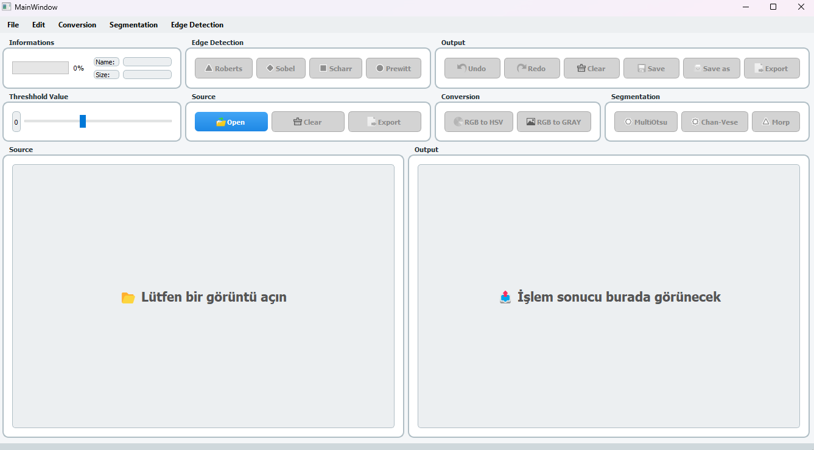
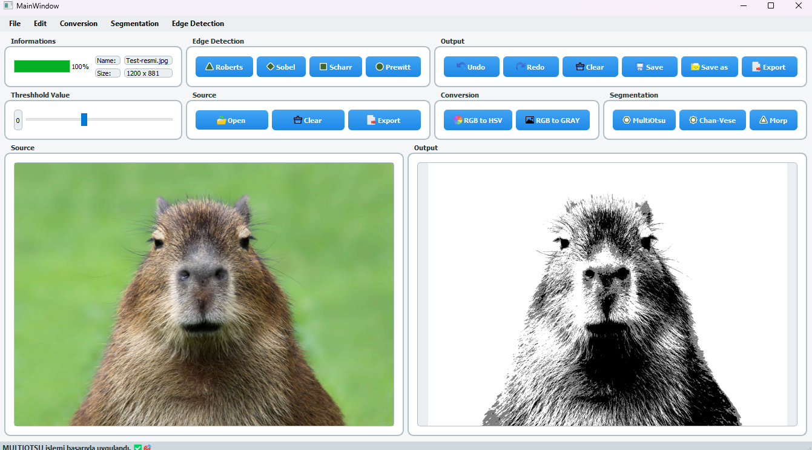
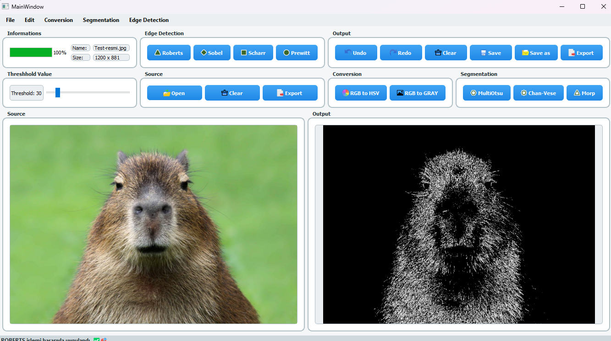
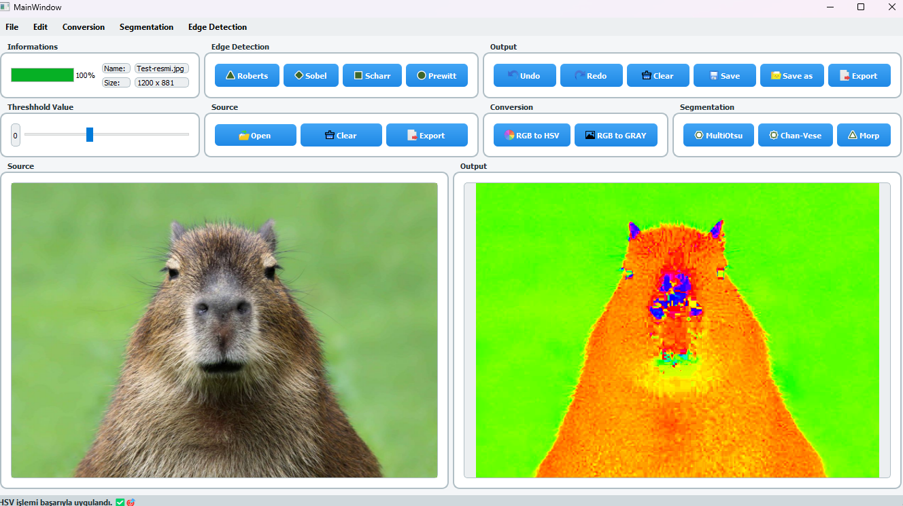

# 🧠 PyQt5 Image Processing Studio

A modular and object-oriented image processing application built with **PyQt5**, designed for real-time image operations such as grayscale and HSV conversion, segmentation (Multi-Otsu, Chan-Vese, Morphological Snakes), and edge detection (Sobel, Scharr, Prewitt, Roberts).

---

## 🚀 Features

- 🎨 **Real-time image display and manipulation**  
- 🧩 **Modular architecture** using object-oriented design (OOP)
- 📚 **Inheritance, Polymorphism, Encapsulation, Abstraction** applied throughout
- ⚙️ Dynamic threshold slider for edge detection
- ♻️ **Undo/Redo** operation history
- 📦 Integrated **file handling** and **export** features
- 🌈 Smooth UI transitions using fade and hover animations
- 🧵 **Multithreaded processing** via `QThread` to ensure responsive GUI
- 🧪 Doxygen-style comments for all modules (documentation-ready)

---

## 🧱 Project Structure

```text
📁 root/
├── main.py                      # Main application runner
├── LabFinal.py                 # Auto-generated GUI class from Qt Designer
├── conversion.py               # RGBToGray, RGBToHSV + Handler
├── segmentation.py             # MultiOtsu, Chan-Vese, MorphSnakes + Handler
├── edge_detection.py           # Sobel, Scharr, etc. + EdgeDetectionHandler
├── file_operations.py          # File save/export dialogs
├── image_manager.py            # Image load, clear, UI display updates
├── processing_worker.py        # QThread-based image processor
├── ui_state_manager.py         # GUI button/state control
├── ui_effects.py               # Fade & hover animations
├── style.qss                   # External style sheet
├── icons/                      # Custom icons for UI
└── README.md                   # You're here!
```

---

## 📷 Image Operations

| Operation Type   | Methods                                    |
|------------------|--------------------------------------------|
| **Conversion**   | `Grayscale`, `HSV`                         |
| **Segmentation** | `Multi-Otsu`, `Chan-Vese`, `Morph. Snakes`|
| **Edge Detection** | `Sobel`, `Scharr`, `Prewitt`, `Roberts`   |

All operations are encapsulated in handler classes, enabling runtime polymorphism and abstraction.

---

## 🧠 Object-Oriented Design (OOP)

Each operation type is defined using:
- ✅ Abstract Base Classes (`ABC`)
- ✅ Specific subclasses implementing `.apply()` or `.detect()`
- ✅ Handler classes to isolate operation logic

### Example:

```python
class ImageOperation(ABC):
    def apply(self): pass

class RGBToGray(ImageOperation):
    def apply(self):
        # grayscale conversion logic
```

---

## 💻 How to Run

1. Make sure you have Python 3.7+ installed.
2. Install dependencies:

```bash
pip install PyQt5 scikit-image numpy
```

3. Run the application:

```bash
python main.py
```

---

## 📚 Requirements

- `PyQt5`
- `scikit-image`
- `numpy`

---

## 📖 Documentation

All modules are documented using **Doxygen-style** Python docstrings. You can generate HTML or PDF documentation using Doxygen with the following config:

```bash
doxygen -g  # (first time only)
# edit Doxyfile to include *.py and set EXTRACT_ALL = YES
doxygen Doxyfile
```

---
## ✨ Screenshots

### 🖼️ Main Interface


### 🔍 Segmentation Example


### 🧠 Edge Detection Result


### 🎨 Hue Saturation Result


---

## 👨‍💻 Author

**Doğukan Avcı**  
_Eskişehir Osmangazi University - Electrical & Electronics Engineering_  


---

## 📝 License

This project is open for academic, educational, and personal use. Contact the author for other use cases.

---

## ✪️ Acknowledgements

- PyQt5 Team
- scikit-image contributors
- Qt Designer GUI Toolkit

---